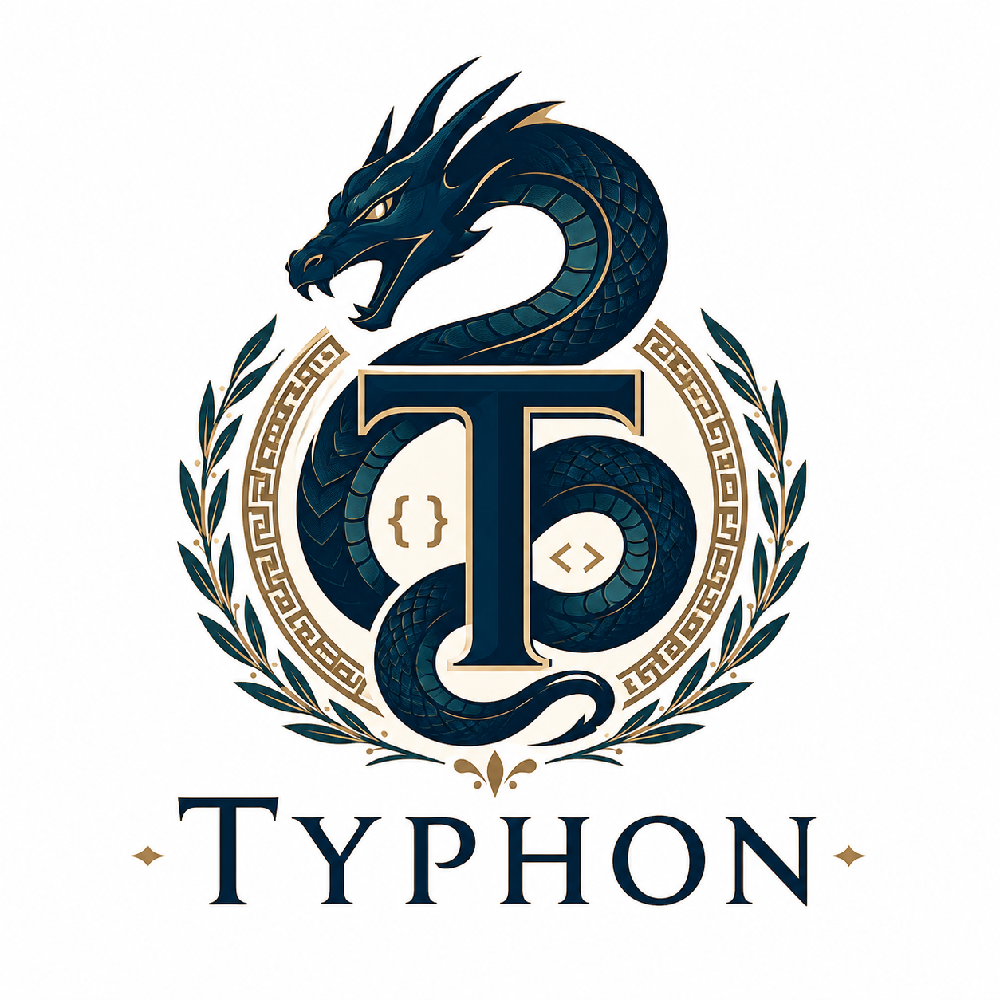

<p align="center">
  
</p>

# Typhon

Typhon is a Python-like language where types are mandatory, in the same spirit
that TypeScript adds a required static type layer to JavaScript.

The syntax stays close to Python, but Typhon requires explicit types for:

- Function parameters.
- Function return values.
- Variable declarations.
- Class fields.
- Collection element types.

Typhon code is intended to feel familiar to Python developers while making type
contracts part of the language instead of optional comments.

## Example

```typhon
type UserId = int

class User:
    id: UserId
    name: str
    email: str | None

    def __init__(self, id: UserId, name: str, email: str | None) -> None:
        self.id = id
        self.name = name
        self.email = email


def normalize_name(name: str) -> str:
    cleaned: str = name.strip()
    return cleaned.title()


def find_user(users: list[User], id: UserId) -> User | None:
    for user: User in users:
        if user.id == id:
            return user
    return None
```

## Rules Demonstrated

- `def add(a: int, b: int) -> int:` is valid.
- `def add(a, b):` is invalid because parameters and return type are missing.
- `def log(message: str) -> void:` is valid for functions that return nothing.
- `count: int = 0` is valid.
- `count = 0` is invalid because the variable type is missing.
- `items: list[str] = []` is valid.
- `items: list = []` is invalid because the element type is missing.

See [examples/user_service.ty](examples/user_service.ty) for a complete valid
example and [examples/invalid_missing_types.ty](examples/invalid_missing_types.ty)
for examples that should fail a Typhon type checker.

## Running Typhon

This repository includes a local Python virtual environment and a small Typhon
wrapper that validates mandatory types, transpiles `.ty` syntax into Python, and
adds runtime type enforcement.

Install Typhon as a user-level command:

```powershell
python -m pip install --user -e .
```

After that, `typhon` can be run from any directory as long as Python's user
Scripts directory is on `PATH`.

Run a file like Python:

```powershell
typhon examples\user_service.ty
```

Typhon executes script files like Python does:

- `__name__` is set to `"__main__"`.
- `__file__` is set to the script path.
- The script's directory is inserted at the front of `sys.path`, so local imports
  beside the `.ty` file work from any current working directory.

Run a valid program:

```powershell
.\run_typhon.ps1 examples\user_service.ty
```

Or call the module directly:

```powershell
.\.venv\Scripts\python.exe -m typhon run examples\user_service.ty
```

Print the generated Python:

```powershell
.\.venv\Scripts\python.exe -m typhon transpile examples\user_service.ty
```

Try the validation failure example:

```powershell
.\.venv\Scripts\python.exe -m typhon run examples\invalid_missing_types.ty
```

Try the runtime type failure example:

```powershell
.\.venv\Scripts\python.exe -m typhon run examples\runtime_type_error.ty
```

Try the no-return `void` example:

```powershell
.\.venv\Scripts\python.exe -m typhon run examples\void_return.ty
```

## Transpyle Note

The `transpyle` package is installed in `.venv` as the requested transpilation
backend target. Its full dependency tree currently does not install cleanly on
the available Python 3.14 runtime because `typed-ast` needs native build tools.
For now, Typhon uses the local wrapper in [typhon/transpiler.py](typhon/transpiler.py)
for the actual `.ty` to Python lowering step.
