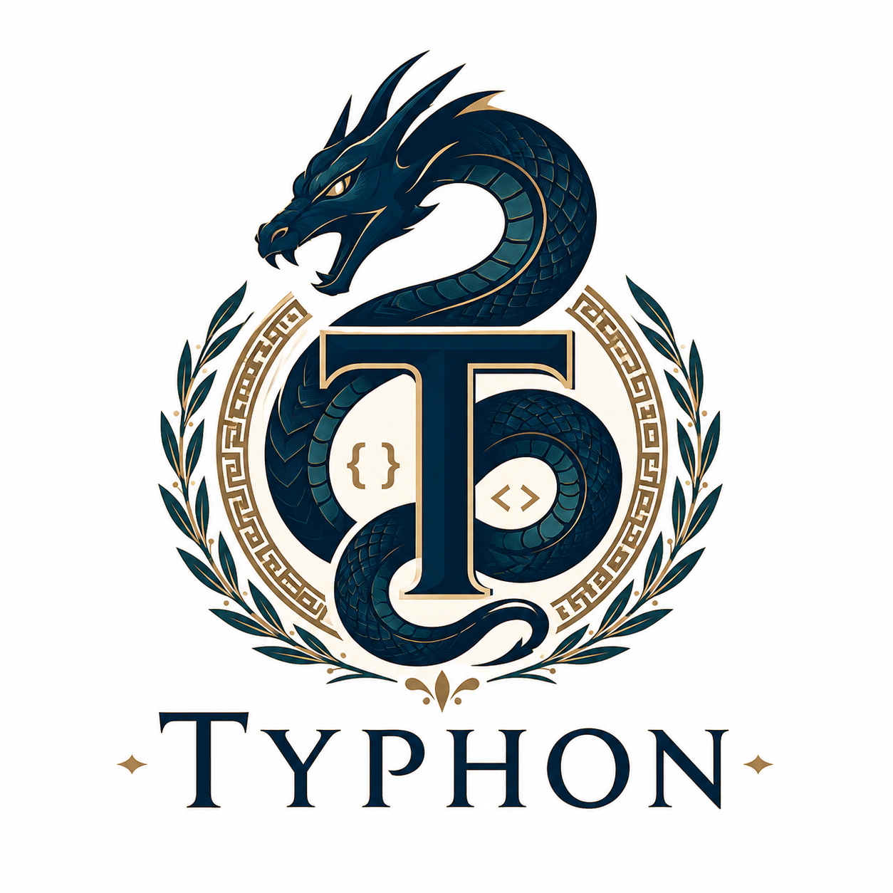

<p align="center">
  
</p>

# Typhon

Typhon is a Python-like language where types are mandatory, in the same spirit
that TypeScript adds a required static type layer to JavaScript.

The syntax stays close to Python, but Typhon requires explicit types for:

- Function parameters.
- Function return values.
- Variable declarations.
- Class fields.
- Collection element types.

Typhon code is intended to feel familiar to Python developers while making type
contracts part of the language instead of optional comments.

## Example

```typhon
type UserId = int

class User:
    id: UserId
    name: str
    email: str | None

    def __init__(self, id: UserId, name: str, email: str | None) -> None:
        self.id = id
        self.name = name
        self.email = email


def normalize_name(name: str) -> str:
    cleaned: str = name.strip()
    return cleaned.title()


def find_user(users: list[User], id: UserId) -> User | None:
    for user: User in users:
        if user.id == id:
            return user
    return None
```

## Rules Demonstrated

- `def add(a: int, b: int) -> int:` is valid.
- `def add(a, b):` is invalid because parameters and return type are missing.
- `def log(message: str) -> void:` is valid for functions that return nothing.
- `count: int = 0` is valid.
- `count = 0` is invalid because the variable type is missing.
- `items: list[str] = []` is valid.
- `items: list = []` is invalid because the element type is missing.

See [examples/user_service.ty](examples/user_service.ty) for a complete valid
example and [examples/invalid_missing_types.ty](examples/invalid_missing_types.ty)
for examples that should fail a Typhon type checker.

## Running Typhon

Typhon now runs through a native Go VM by default. The Go engine parses,
statically checks, compiles to bytecode, and executes `.ty` files without using
CPython as the runtime.

The older Python transpiler is still available as a legacy/debug backend through
the `transpile` command.

Install Typhon as a user-level command:

```powershell
python -m pip install --user -e .
```

After that, `typhon` can be run from any directory as long as Python's user
Scripts directory is on `PATH`.

Run a file:

```powershell
typhon examples\user_service.ty
```

Typhon executes script files like Python does:

- `__name__` is set to `"__main__"`.
- `__file__` is set to the script path.
- The script's directory is inserted at the front of `sys.path`, so local imports
  beside the `.ty` file work from any current working directory.
- `.ty` modules can import other `.ty` modules from the same import path.

Typhon also includes a small parallel runtime:

```typhon
from typhon.parallel import TyphonTask, join, spawn


def double(value: int) -> int:
    return value * 2


task: TyphonTask = spawn(double, 21)
result: int = join(task)
print(result)
```

Run a valid program:

```powershell
.\run_typhon.ps1 examples\user_service.ty
```

Or call the native Go CLI directly:

```powershell
go run ./cmd/typhon run examples\user_service.ty
```

Check a file without executing it:

```powershell
go run ./cmd/typhon check examples\user_service.ty
```

Print the native VM bytecode:

```powershell
go run ./cmd/typhon bytecode examples\user_service.ty
```

Print the legacy generated Python:

```powershell
.\.venv\Scripts\python.exe -m typhon transpile examples\user_service.ty
```

Try the validation failure example:

```powershell
.\.venv\Scripts\python.exe -m typhon run examples\invalid_missing_types.ty
```

Try the runtime type failure example:

```powershell
.\.venv\Scripts\python.exe -m typhon run examples\runtime_type_error.ty
```

Try the no-return `void` example:

```powershell
go run ./cmd/typhon run examples\void_return.ty
```

Try the parallel task example:

```powershell
go run ./cmd/typhon run examples\parallel_task.ty
```

## Python Bridge

Typhon can call Python libraries through a subprocess bridge. Native `.ty` code
still runs on the Go VM; Python only starts when a Python module is imported.

Use the explicit `py.` namespace:

```typhon
import py.json as json
from py.math import gcd


def main() -> void:
    values: list[int] = [gcd(12, 8), 2]
    encoded: str = json.dumps(values)
    print(encoded)


main()
```

Run it:

```powershell
go run ./cmd/typhon run examples\python_bridge.ty
```

Plain Python imports also go through the bridge when no local `.ty` import is
used:

```typhon
import requests as req
```

Some common Python-style imports are handled natively by the Go VM instead of
starting Python. For example, `py.json`/`json` currently use a native `json.dumps`
shim for much lower startup cost.

Simple Typhon values (`int`, `str`, `bool`, `None`, and lists) are converted to
Python values. Python primitives come back as Typhon values; other Python
objects come back as `PyObject` handles and print using Python's `repr`.

Set `TYPHON_PYTHON` to choose the Python interpreter for the bridge. By default,
Typhon tries the repo `.venv` first, then `python`, then `python3`.

## Benchmarks

Generate a simple visual Python vs Typhon benchmark:

```powershell
.\.venv\Scripts\python.exe benchmarks\visual_benchmark.py --runs 7 --warmups 1
```

Generate a resource usage benchmark:

```powershell
.\.venv\Scripts\python.exe benchmarks\resource_benchmark.py --runs 5 --warmups 1 --poll-ms 0.1 --include-warm-bridge
```

Compare cold vs warm Python bridge startup:

```powershell
.\.venv\Scripts\python.exe benchmarks\bridge_warm_benchmark.py --runs 7 --warmups 1
```

Try precompiling Python package bytecode and measuring bridge impact:

```powershell
.\.venv\Scripts\python.exe benchmarks\precompile_python_libs.py requests urllib3 certifi charset_normalizer idna --runs 7 --warmups 1 --clean-first
```

The script builds the native Typhon CLI, runs paired Python/Typhon examples, and
writes:

- `benchmarks/results/python_vs_typhon.svg`
- `benchmarks/results/python_vs_typhon.csv`
- `benchmarks/results/python_vs_typhon.md`
- `benchmarks/results/python_vs_typhon_resources.svg`
- `benchmarks/results/python_vs_typhon_resources.csv`
- `benchmarks/results/python_vs_typhon_resources.md`
- `benchmarks/results/python_bridge_warmup.svg`
- `benchmarks/results/python_bridge_warmup.csv`
- `benchmarks/results/python_bridge_warmup.md`
- `benchmarks/results/python_pyc_bridge.csv`
- `benchmarks/results/python_pyc_bridge.md`

Run a Typhon program with an eager Python worker:

```powershell
go run ./cmd/typhon --warm-python run examples\python_bridge.ty
```

You can also set `TYPHON_WARM_PYTHON=1` for `run` commands.

Precompiled `.pyc` files can reduce Python parse/compile work for pure Python
packages, but they do not remove CPython startup, subprocess IPC, import
execution, or Typhon/Python value marshalling. In the current benchmark,
precompiling the `requests` dependency set did not improve bridge latency.

## Transpyle Note

The `transpyle` package is installed in `.venv` as the requested transpilation
backend target. Its full dependency tree currently does not install cleanly on
the available Python 3.14 runtime because `typed-ast` needs native build tools.
The Go VM is the primary runtime; Typhon uses the local wrapper in
[typhon/transpiler.py](typhon/transpiler.py) only for legacy `.ty` to Python
lowering.
