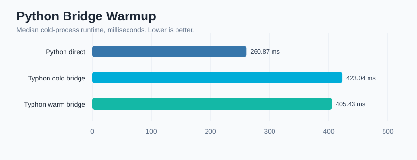

# Python Bridge Warmup Benchmark

Median cold-process runtime for a real Python bridge case.

- Timed runs per case: `9`
- Warmups per case: `1`

| Case | Median ms |
|---|---:|
| Python direct | 260.869 |
| Typhon cold bridge | 423.045 |
| Typhon warm bridge | 405.428 |

Notes:
- `Typhon cold bridge` starts Python when the first Python import executes.
- `Typhon warm bridge` starts Python asynchronously during VM setup using `--warm-python`.
- For tiny programs, warmup can only hide the part of Python startup that overlaps parse/check/compile.
