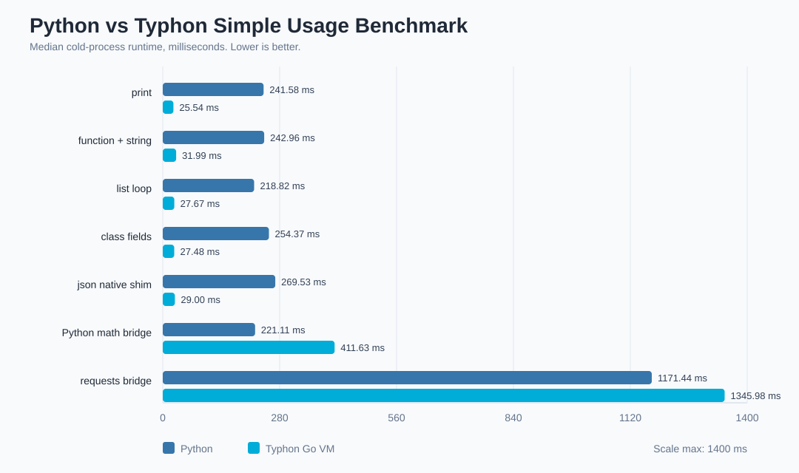

# Python vs Typhon Visual Benchmark

Median cold-process runtime in milliseconds. Lower is better.

- Timed runs per case: `9`
- Warmups per case: `2`
- Typhon binary: `C:\Users\User\Documents\Typhon\benchmarks\bin\typhon.exe`

| Case | Python ms | Typhon ms | Typhon / Python |
|---|---:|---:|---:|
| print | 241.582 | 25.539 | 0.11x |
| function + string | 242.961 | 31.990 | 0.13x |
| list loop | 218.819 | 27.670 | 0.13x |
| class fields | 254.369 | 27.477 | 0.11x |
| json native shim | 269.533 | 28.996 | 0.11x |
| Python math bridge | 221.115 | 411.631 | 1.86x |
| requests bridge | 1171.437 | 1345.975 | 1.15x |

Notes:
- These are CLI process benchmarks, so startup cost is included.
- `json native shim` is served by the Go VM without starting Python.
- `Python math bridge` intentionally starts the Python subprocess bridge from Typhon.
- `requests bridge` imports a real third-party Python package through the bridge.
- Native Typhon code and Python bridge calls have different performance profiles.
