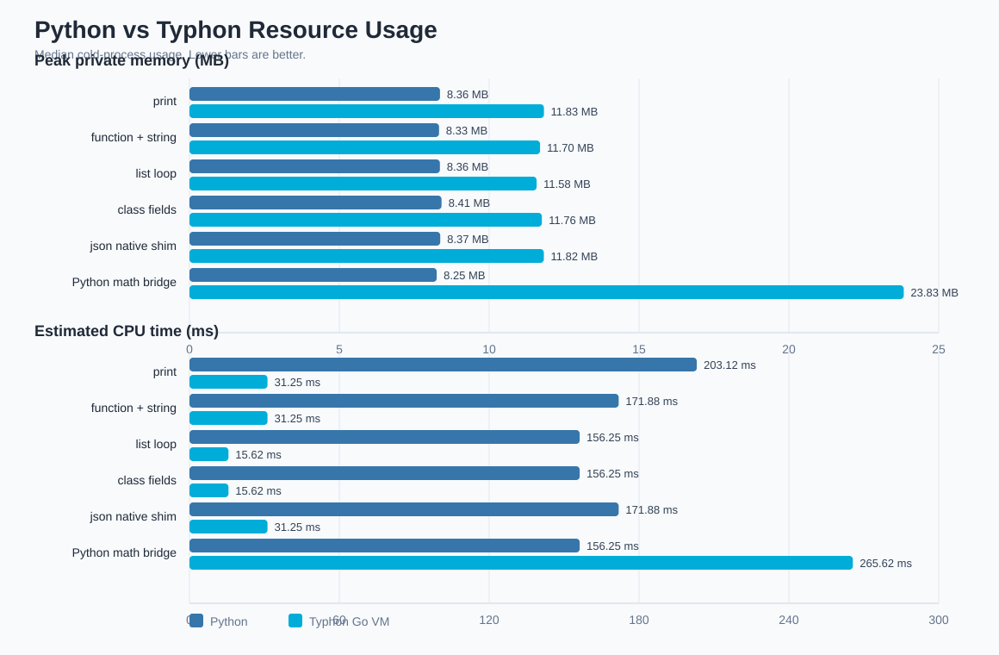

# Python vs Typhon Resource Usage Benchmark

Median cold-process resource usage. Lower is better for wall time, CPU, and memory.

- Timed runs per case: `5`
- Warmups per case: `1`
- Process polling interval: `0.10 ms`
- Typhon binary: `C:\Users\User\Documents\Typhon\benchmarks\bin\typhon.exe`

| Case | Py private MB | Ty private MB | Py CPU ms | Ty CPU ms | Py procs | Ty procs |
|---|---:|---:|---:|---:|---:|---:|
| print | 8.36 | 11.83 | 203.12 | 31.25 | 2 | 1 |
| function + string | 8.33 | 11.70 | 171.88 | 31.25 | 2 | 1 |
| list loop | 8.36 | 11.58 | 156.25 | 15.62 | 2 | 1 |
| class fields | 8.41 | 11.76 | 156.25 | 15.62 | 2 | 1 |
| json native shim | 8.37 | 11.82 | 171.88 | 31.25 | 2 | 1 |
| Python math bridge | 8.25 | 23.83 | 156.25 | 265.62 | 2 | 3 |

Warm Python bridge comparison:

| Case | Cold Ty private MB | Warm Ty private MB | Cold Ty CPU ms | Warm Ty CPU ms |
|---|---:|---:|---:|---:|
| Python math bridge | 23.83 | 24.93 | 265.62 | 296.88 |

Notes:
- Memory is sampled from the process tree and reported as median peak private bytes.
- CPU time is sampled from the process tree and can undercount very short-lived child processes.
- The Python bridge case includes the Typhon process and its Python worker process.
- The json native shim is served by the Go VM without starting Python.
- When present, warm bridge columns use `typhon --warm-python run`.
